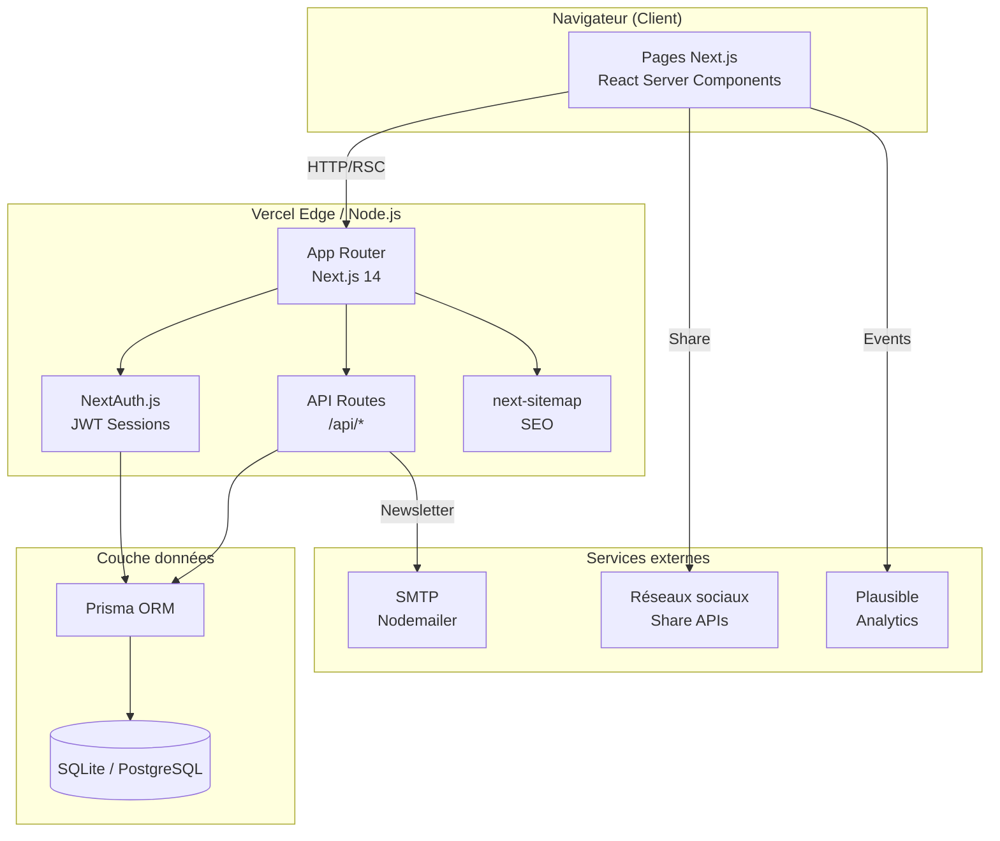

# ARCHITECTURE.md — lemonde6

Site d'information grand public inspiré de www.lemonde.fr

---

## Stack technique

| Composant | Choix | Justification |
|-----------|-------|---------------|
| Framework | **Next.js 14 App Router** | SSR natif pour SEO, streaming, server components |
| Style | **Tailwind CSS** | Productivité, design system cohérent, purge CSS auto |
| ORM | **Prisma 5** | Type-safe, migrations, compatible SQLite → PostgreSQL |
| Base de données | **SQLite** (dev) → **PostgreSQL** (prod) | Zero config en dev, migration transparente |
| Auth | **NextAuth.js v5** | JWT, session, OAuth extensible |
| Email | **Nodemailer** | Newsletter, transactionnel |
| SEO | **next-sitemap** | Sitemap.xml, robots.txt générés automatiquement |
| Deploy | **Vercel** | CI/CD intégré, edge network, preview deployments |
| Analytics | **Plausible** | Privacy-first, léger |

---

## Diagramme d'architecture



---

## Structure des fichiers

```
lemonde6/
├── src/
│   ├── app/
│   │   ├── layout.tsx              # Layout global (header, footer, meta)
│   │   ├── page.tsx                # Page d'accueil
│   │   ├── globals.css             # Styles globaux
│   │   ├── (auth)/
│   │   │   ├── login/page.tsx      # Connexion
│   │   │   └── register/page.tsx   # Inscription
│   │   ├── articles/
│   │   │   ├── [slug]/page.tsx     # Détail article (SSR)
│   │   │   └── page.tsx            # Liste articles
│   │   ├── categories/
│   │   │   └── [slug]/page.tsx     # Articles par catégorie
│   │   ├── search/
│   │   │   └── page.tsx            # Résultats recherche
│   │   ├── admin/
│   │   │   ├── page.tsx            # Dashboard admin
│   │   │   ├── articles/page.tsx   # CRUD articles
│   │   │   └── users/page.tsx      # Gestion utilisateurs
│   │   └── api/
│   │       ├── auth/[...nextauth]/ # NextAuth endpoints
│   │       ├── articles/           # CRUD articles
│   │       ├── search/             # Full-text search
│   │       ├── newsletter/         # Subscribe/unsubscribe
│   │       └── categories/         # Catégories
│   ├── components/
│   │   ├── layout/                 # Header, Footer, Nav
│   │   ├── articles/               # ArticleCard, ArticleList, Hero
│   │   ├── search/                 # SearchBar, SearchResults
│   │   ├── auth/                   # LoginForm, RegisterForm
│   │   ├── newsletter/             # NewsletterForm
│   │   └── ui/                     # Boutons, inputs, badges
│   ├── lib/
│   │   ├── prisma.ts               # Client Prisma singleton
│   │   └── auth.ts                 # Config NextAuth
│   └── types/
│       └── index.ts                # Types TypeScript partagés
├── prisma/
│   ├── schema.prisma               # Schéma DB
│   └── seed.ts                     # Données de démo (30+ articles)
├── public/
│   └── images/                     # Assets statiques
├── next.config.js
├── tailwind.config.ts
├── next-sitemap.config.js          # Config sitemap
├── .env                            # Variables locales (gitignore)
├── .env.example                    # Template variables
└── README.md
```

---

## Schéma base de données (simplifié)

```
User ────────── Article ──── Category
  |               |   \───── Tag (many-to-many)
  └── Comment ───┘
                  └── Author

NewsletterSubscriber (standalone)
```

### Entités principales
- **User** : id, email, name, password (bcrypt), role (reader/admin)
- **Article** : id, title, slug, content, excerpt, imageUrl, status, featured, publishedAt
- **Category** : id, name, slug, description, color
- **Author** : id, name, bio, avatar
- **Tag** : id, name, slug
- **Comment** : id, content, userId, articleId
- **NewsletterSubscriber** : id, email, confirmedAt, unsubscribedAt

---

## API Routes principales

| Méthode | Route | Description |
|---------|-------|-------------|
| GET | `/api/articles` | Liste paginée |
| GET | `/api/articles/[slug]` | Détail article |
| POST | `/api/articles` | Créer article (admin) |
| PUT | `/api/articles/[id]` | Modifier article (admin) |
| DELETE | `/api/articles/[id]` | Supprimer article (admin) |
| GET | `/api/search?q=` | Recherche full-text |
| GET | `/api/categories` | Liste catégories |
| POST | `/api/newsletter/subscribe` | Abonnement |
| GET | `/api/newsletter/unsubscribe?token=` | Désabonnement |
| POST | `/api/auth/[...nextauth]` | NextAuth endpoints |

---

## Décisions techniques

### Next.js 14 App Router (vs Pages Router)
- Server Components réduisent le JS côté client
- Streaming pour UX optimale (articles longs)
- Layouts imbriqués pour header/footer partagés
- SSR natif = Google indexe le HTML complet

### SQLite → PostgreSQL
- SQLite en dev : zéro infra, fichier unique, idéal CI
- Prisma abstrait la DB : `provider = "postgresql"` + `DATABASE_URL` en prod
- Pas de changement de code nécessaire

### NextAuth.js v5 (beta)
- Compatible App Router natif
- JWT strategy : stateless, scalable
- Sessions serveur optionnelles via adapter Prisma

### Tailwind CSS
- Pas de CSS à écrire manuellement
- Design tokens cohérents (couleurs, spacing)
- Purge automatique → bundle CSS minimal

---

## Commandes utiles

```bash
# Développement
npm run dev              # Lance Next.js en mode dev (http://localhost:3000)

# Base de données
npx prisma migrate dev   # Créer une migration
npx prisma studio        # Interface visuelle DB
npx prisma db push       # Appliquer schema sans migration
npm run seed             # Remplir avec des données de démo

# Production
npm run build            # Build Next.js
npm run start            # Démarrer en mode production

# Linting
npm run lint             # ESLint
```

---

## Contraintes environnement

- **Node.js** : >= 18.17.0 (requis par Next.js 14)
- **npm** : >= 9.0
- **SQLite** : inclus dans Prisma, aucune installation externe
- **Environnement** : Linux x64, shell bash
